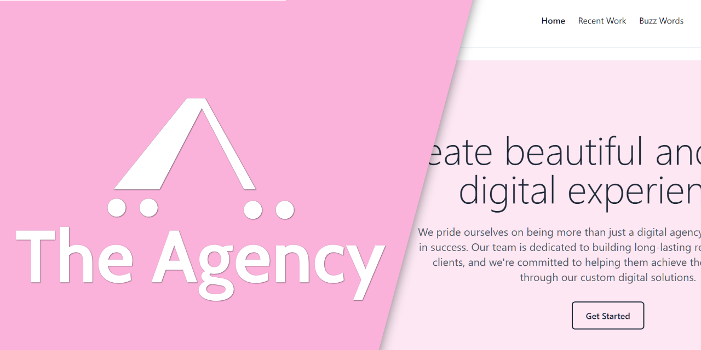
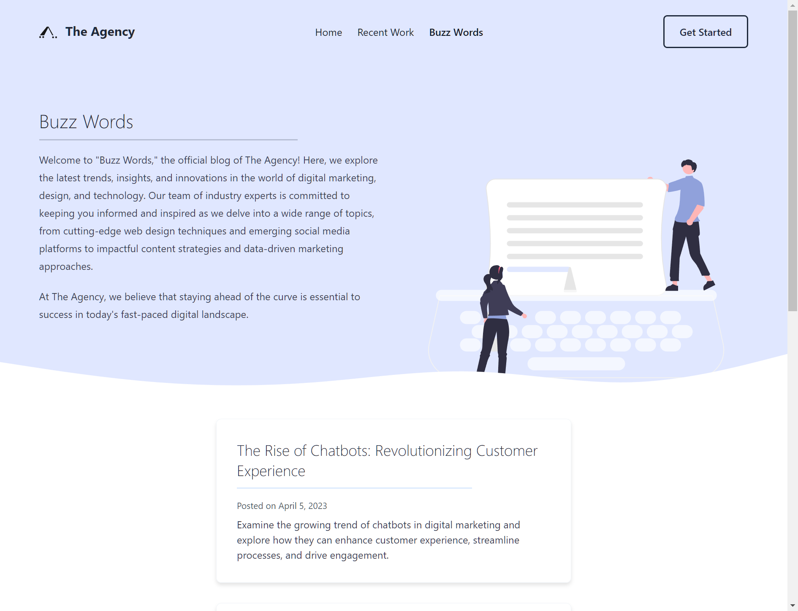
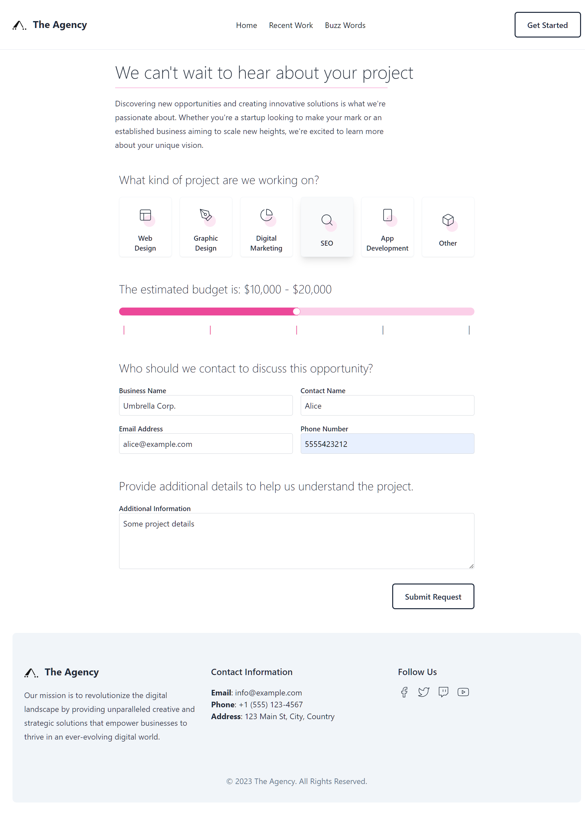
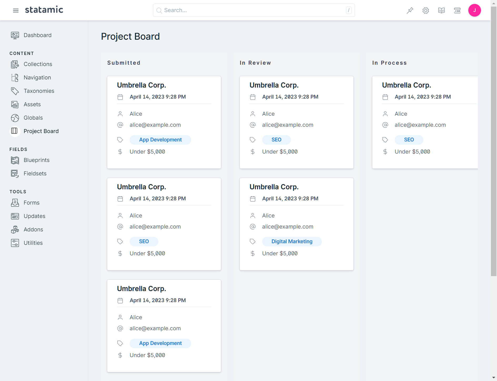
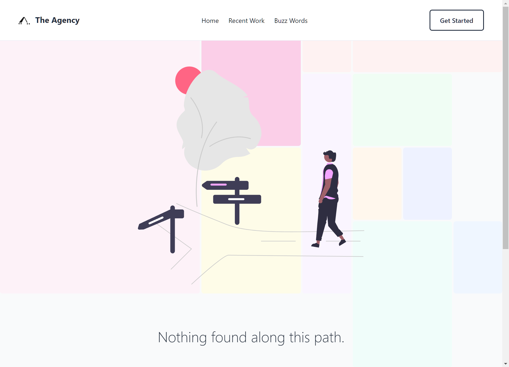

The Agency is a free Statamic Starter Kit designed as an example of utilizing various techniques to implement a highly customized Statamic experience.

The Agency Starter Kit can be used as-is as the starting point for any new project and comes with the following features out of the box:

* A simple home page design with a prominent call-to-action hero section
* Service offerings
* Customer testimonials section
* Simple project portfolio page, with individual case-study pages
* An integrated blog ("The Buzz") with paginated post listings and individual blog post pages
* A custom project request form and Control Panel management system

## Installation

The Agency Starter Kit may be installed from the command line using the following command:

```bash
php please starter-kit:install stillat/the-agency-starter-kit
```

Once the Starter Kit has been installed you will need to install and compile the front end assets using the following commands:

```bash
npm install
npm run dev
```

## General Project Overview

This Starter Kit contains many custom Tags, modifiers, classes, JavaScript files, additional resources, and routes.

### Multiple Antlers Layouts

This example project utilizes the `stillat/antlers-layout` [https://github.com/Stillat/antlers-layouts](https://github.com/Stillat/antlers-layouts) package to swap out the layout file used from *within* an Antlers template. The Tags provided by this package are used extensively throughout the site to change the layout and share data with the layout file from the current template (Statamic renders Antlers layouts *last*).

As an example, the `/buzz-words` template utilizes it to change the layout, as well as pass some data to the layout to change the header, content, and SVG graphic that is displayed:

```antlers
{{# Change the Antlers layout we will use. #}}
{{ layout:layouts/large-header /}}

{{ if get:page == null || get:page < 2 }}
    {{ layout:share show_marketing_header="true"
                    :marketing_header_title="title"
                    :marketing_header_content="heading_blurb"
                    marketing_svg_name="typewriter"
                    marketing_header_background="bg-indigo-100" /}}
{{ else }}
    {{ layout:share marketing_header_background="bg-indigo-100" /}}
{{ /if }}

{{# Rest of the template... #}}

```



### Global SEO Meta Fields

The `app/Fields/` namespace provides a location to define Blueprint sections and fields that should appear on every Collection entry within the Control Panel. The Starter Kit uses this to ensure that each blog entry, project, and page contains SEO meta tag fields, such as keywords and descriptions. This file interacts with some event listeners within the `app/Listeners` directory, which contains the logic for adding custom fields to each Blueprint. Specifically, these file paths:

* `app/Listeners/BlueprintSavingListener.php`
* `app/Listeners/MetaBlueprintFieldsListener.php`

In addition to the listeners to facilitate the custom SEO meta fields, the `app/Listener` directory also contains a listener that is used to minify the HTML output of each page.

### Creating Collection Entries from the Front End

The Agency provides an example of creating collection entries from the front end. The Contact page allows visitors to submit project requests; instead of using the Forms feature, this Starter Kit provides examples of creating custom routes, HTTP middleware (replicating the honeypot form field behavior), and creating/saving the entries using custom PHP code.

The files are involved in creating the collection entries:

* `routes/web.php`: Contains the form's action to handle the entry validation, creation, and saving
* `app/Tags/GetBlueprint.php`: Provides a custom Tag implementation that is used to extract the select field options to be used within the front end template
* `resources/pages/contact.antlers.html`: The template used to implement the front end form

All of the custom modifiers within `app/Modifiers` are also used in some way to create the final project request form. These are not directly related to creating entries, but are purely to help simplify the template's logic.



### Custom Control Panel Integration

The Agency Starter Kit provides an example of adding menu items to the Control Panel and adding custom pages to the Control Panel for the end user. The example provided by The Agency is a simple Kanban-style view that can be used to update the current project status of submissions.

This feature makes use of the following files:

* `app/Projects/ProjectBoardRepository.php`: Servers as a central location for managing details about project requests
* `app/Providers/AppServiceProvider.php`: Registers our custom Control Panel CSS and JavaScript assets, as well as adds a new navigation menu item to the Control Panel's "Content" section
* `app/Providers/RouteServiceProvider.php`: Pushes all of the Control Panel routes inside the `routes/cp.php` file using Statamic's `Statamic::pushCpRoutes` helper method
* `resources/css/cp.css`: Includes the `tailwindcss/utilities` file to help build our custom Control Panel view
* `resources/js/components/*`: Contains the Vue component implementations used in our custom Control Panel view
* `resources/js/cp.js`: Registers our custom Vue components with Statamic to make them available in our template
* `resources/views/cp/project-board.blade.php`: Extends Statamic's Control Panel layout and includes our custom Vue components



### Custom Sitemap Generator

This Starter Kit also provides an example implementation for generating custom sitemaps. This feature utilizes PHP's `XMLWriter` and various Statamic data repositories to fetch our content and generate a sitemap. The following files interact to help implement this feature:

* `app/Utilities/SiteMapGenerator.php`: Provides the sitemap generator implementation
* `config/sitemap.php`: Provides a central location to exclude collections from sitemap generation, such as the Testimonials collection
* `routes/web.php`: Provides a `sitemap.xml` route that will return an XML response containing the generated sitemap

### Randomized and Unique Array Options

The 404-page template of this Starter Kit will randomly apply background colors to a grid. This is accomplished using a custom Tag that accepts a list of choices to select from. Once an option has been selected, it is removed from the list of available choices for subsequent selections.

The following files are used for this:

* `app/Tags/RandomOnce.php`: The custom Tag implementation
* `resources/views/errors/404.antlers.html` The 404-error page template implementation



### Custom Page Title Behavior

This Starter Kit implements custom page title behavior through the `app/Tags/SiteTitle.php` custom Tag. This Tag provides examples of the following:

* Interacting with the `Entry` façade
* Finding entries based on their URI
* Interacting with a custom Tag's context
* Querying Global Sets and retrieving their values for the current site

## Provided Collections and Blueprints

The Agency provides the following collections:

* Blog: Contains all entries for "The Buzz", the sample blog
* Pages: Contains the entries for each page of the site, including the home page, project request page, and more
* Portfolio: Contains all of the projects and case studies showcased on the `/projects` page
* Project Requests: When visitors complete the project request form on the `/contact` page, submissions will be saved to this collection
* Services: A collection of services that are displayed prominently on the home page
* Testimonials: A collection of customer testimonials that are displayed prominently on the home page

Some pages, such as the home page, testimonial, etc. have their own custom blueprint to customize the Control Panel experience and help tailor the content.

Most blueprints will automatically inherit the following SEO meta fields:

| Field | Description |
|---|---|
| Keywords | An optional list of SEO keywords |
| Description | An optional SEO description |

The following noteworthy blueprints are provided by this Starter Kit:

**Blog Page**: The blueprint for the blog listing page

| Field | Description |
|---|---|
| Title | The page's title |
| Heading Blurb | The content that appears prominently on the larger header |

The blueprint for the Portfolio page contains similar fields.

**Contact**: The blueprint for the '/contact' page

| Field | Description |
|---|---|
| Title | The page's title |
| Heading Title | A secondary title that appears at the top of the contact page |
| Content | A Bard field that contains content that appears below the Heading Title at the top of the contact page |

**Home**: The blueprint for the home page

| Field | Description |
| Title | The page's title |
| Content | A replicator field that contains various sets that can appear on the home page |

The home page is a simple example of the "Page Builder" concept, in which custom Antlers views are rendered depending on the type of set encountered.

The home page's template can be found at `resources/views/pages/home.antlers.html`, and a simple Antlers loop that iterates each set within the `content` replicator field:

```antlers
{{ content }}
    {{ partial:if_exists src="components/home/{type}" /}}
{{ /content }}
```

The `type` variable is provided by each set within the Replicator field (this is also true for Bard fields with sets!). The `{{ partial:if_exists }}` Tag will load one of the partials within the `resources/views/components/home` directory, if a match exists.

There are many other blueprints, such as those that contain blog post entries and project request submissions. These are fairly typical blueprints, and can explored within the Control Panel, or by reading through the YAML files.

## Resources

This Starter Kit makes use of a number of custom graphics, as well as those from the following sources:

* Header SVG graphics came from unDraw: https://undraw.co/
* SVG icons (social, project board icons, etc.) came from Feather: https://feathericons.com/
* The "Board" icon used in the custom Control Panel navigation menu item is from Streamline's Regular icon set: https://www.streamlinehq.com/icons/legacy-streamline-regular
* Sample images are from Unsplash: https://unsplash.com/
* Customer profile images used for testimonials were generated using Lorem Faces: https://loremfaces.com/
* Favicon assets generated using https://realfavicongenerator.net/
* The Project Board view components was adapted from this example found on Code Sandbox: https://codesandbox.io/s/animated-draggable-kanban-board-with-tailwind-and-vue-1ry0p


## License

"The Agency" is free software released under the MIT License.

Feel free to use it as a starting point for a project, or take things from it. Redistribution as a Starter Kit is prohibited.
